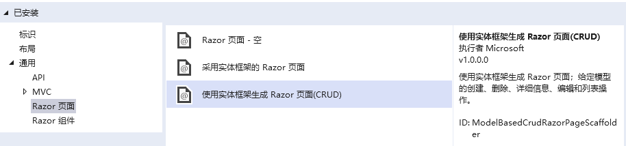
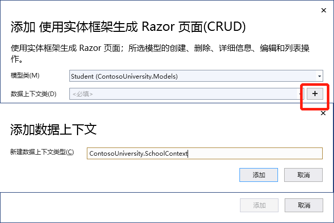

# EF Core 教程
## 1. EFCore与Razor Pages（轻量级Web界面）的交互 ##
应用地址: [ContosoUniversity](https://github.com/CaptainDra/EFCoreDemo/tree/master/ContosoUniversity)    
通过轻量级web网页开发绑定学生系统的增删改查等功能。
- 步骤1：创建一个.NET Core 5.0版本，命名为并ContosoUniversity    
  
- 步骤2：更改Pages/Shared/_Layout.cshtml中代码：
    - 重命名其中ContosoUniversity项，改为Contoso University，其中共有三处
    - 删除"ul class="navbar-nav flex-grow-1"中原本的主页与隐私改为关于、学生、课程、讲师、部门等五项
- 步骤3：替换Pages/Index.cshtml中代码，改为本系统界面
- 步骤4：在项目文件夹中创建"Models"文件夹以创建数据模型    
    - 创建Students.cs, 以ID作为主键，ICollection<Enrollment>来连接数据库连接
    - 创建Enrollment.cs，以EnrollmentID作为主键，CourseID与StudentID作为外键链接其余表，用enum声明可空Grade
    - 创建Course.cs，以CourseId作为主键（使用[DatabaseGenerated(DatabaseGeneratedOption.None)]特性即可指定）
- 步骤5：搭建学生页面基架
    - 创建Pages/Students文件夹，右键点击此文件夹添加->新搭建基架的项目，并用如下图配置创建
      
    - 在接下来界面用下图参数来配置模型与数据
      
    - 成功后基架工具会在appsettings.json文件中生成连接串（指定了SQL Server LocalDB）
    - 更新Data/SchoolContext.cs，其中将DbSet<Student> Student改为了DbSet<Student> Students复数形式，并全局修改_context.Student.变为_context.Students.，并为每个实体集创建DbSet<TEntity>属性，调用OnModelCreating
      - 实体集对应数据库表，其中实体对应表中的行
      - OnModelCreating在SchoolContext初始化后，模型锁定上下文前调用，因为Student实体还会引用其他实体，所以可以用这个来避免上锁
      - 完成变更后生成以确定无其他错误