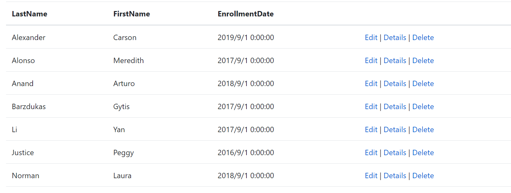

# EF Core 教程
## 1. EFCore与Razor Pages（轻量级Web界面）的交互 ##
应用地址: [ContosoUniversity](https://github.com/CaptainDra/EFCoreDemo/tree/master/ContosoUniversity)    
通过轻量级web网页开发绑定学生系统并且包括两种不同的数据库初始化方法来初始本地数据库。
- 步骤1：创建一个.NET Core 5.0版本，命名为并ContosoUniversity    
  
- 步骤2：更改Pages/Shared/_Layout.cshtml中代码：
    - 重命名其中ContosoUniversity项，改为Contoso University，其中共有三处
    - 删除"ul class="navbar-nav flex-grow-1"中原本的主页与隐私改为关于、学生、课程、讲师、部门等五项
- 步骤3：替换Pages/Index.cshtml中代码，改为本系统界面
- 步骤4：在项目文件夹中创建"Models"文件夹以创建数据模型    
    - 创建Students.cs, 以ID作为主键，ICollection<Enrollment>来连接数据库连接
    - 创建Enrollment.cs，以EnrollmentID作为主键，CourseID与StudentID作为外键链接其余表，用enum声明可空Grade
    - 创建Course.cs，以CourseId作为主键（使用[DatabaseGenerated(DatabaseGeneratedOption.None)]特性即可指定）
- 步骤5：搭建学生页面基架
    - 创建Pages/Students文件夹，右键点击此文件夹添加->新搭建基架的项目，并用如下图配置创建
      
    - 在接下来界面用下图参数来配置模型与数据
      
    - 成功后基架工具会在appsettings.json文件中生成连接串（指定了SQL Server LocalDB）
    - 更新Data/SchoolContext.cs，其中将DbSet<Student> Student改为了DbSet<Student> Students复数形式，并全局修改_context.Student.变为_context.Students.，并为每个实体集创建DbSet<TEntity>属性，调用OnModelCreating
      - 实体集对应数据库表，其中实体对应表中的行
      - OnModelCreating在SchoolContext初始化后，模型锁定上下文前调用，因为Student实体还会引用其他实体，所以可以用这个来避免上锁
      - 完成变更后生成以确定无其他错误
- 步骤6：添加数据库异常筛选器
  - 使用以下语句在命令行管理工具中添加Nuget包，此包提供EFC错误页的.NET Core中间件，帮助判断错误:
    ```
    Install-Package Microsoft.AspNetCore.Diagnostics.EntityFrameworkCore
    ```
  - 在ConfigureServices(IServiceCollection services)中的最后添加一行代码，提供开发过程中有用的错误信息:
    ```c#
    services.AddDatabaseDeveloperPageExceptionFilter();
    ```
- 步骤7： 创建数据库
  - 在Program.cs中使用如下方法创建数据库：
    ```c#
    private static void CreateDbIfNotExists(IHost host)
        {
            using (var scope = host.Services.CreateScope())
            {
                var services = scope.ServiceProvider;
                try
                {
                    var context = services.GetRequiredService<SchoolContext>();
                    // EnsureCreated 直接初始化数据库,如果有数据就删了在重建
                    // 仅适用于在架构快速发展时使用，后期因为不能迁移使用效果不佳
                    context.Database.EnsureCreated();
                    // 使用数据库种子初始化数据库
                    // DbInitializer.Initialize(context);
                }
                catch (Exception ex)
                {
                    var logger = services.GetRequiredService<ILogger<Program>>();
                    logger.LogError(ex, "An error occurred creating the DB.");
                }
            }
        }
    ```
    注意： 此方法会删除现有数据库，然后创建新的数据库
  - 运行应用，点击学生界面即可在界面操作增删改查功能  
- 步骤8： 创建数据库种子来填充空数据库
  - 在Data文件夹中创建DbInitializer.cs并填充如下代码：
    ```c#
    using ContosoUniversity.Data;
    using ContosoUniversity.Models;
    using System;
    using System.Linq;

    namespace ContosoUniversity.Data
    {
        public static class DbInitializer
        {
            public static void Initialize(SchoolContext context)
            {
                context.Database.EnsureCreated();

                // 查询学生信息是否已存在，如果已经有了则直接结束
                if (context.Students.Any())
                {
                    return;   
                }

                var students = new Student[]
                {
                    new Student{FirstName="Carson",LastName="Alexander",EnrollmentDate=DateTime.Parse("2019-09-01")},
                    new Student{FirstName="Meredith",LastName="Alonso",EnrollmentDate=DateTime.Parse("2017-09-01")},
                    new Student{FirstName="Arturo",LastName="Anand",EnrollmentDate=DateTime.Parse("2018-09-01")},
                    new Student{FirstName="Gytis",LastName="Barzdukas",EnrollmentDate=DateTime.Parse("2017-09-01")},
                    new Student{FirstName="Yan",LastName="Li",EnrollmentDate=DateTime.Parse("2017-09-01")},
                    new Student{FirstName="Peggy",LastName="Justice",EnrollmentDate=DateTime.Parse("2016-09-01")},
                    new Student{FirstName="Laura",LastName="Norman",EnrollmentDate=DateTime.Parse("2018-09-01")},
                    new Student{FirstName="Nino",LastName="Olivetto",EnrollmentDate=DateTime.Parse("2019-09-01")}
                };

                context.Students.AddRange(students);
                context.SaveChanges();

                var courses = new Course[]
                {
                    new Course{CourseID=1050,Title="Chemistry",Credits=3},
                    new Course{CourseID=4022,Title="Microeconomics",Credits=3},
                    new Course{CourseID=4041,Title="Macroeconomics",Credits=3},
                    new Course{CourseID=1045,Title="Calculus",Credits=4},
                    new Course{CourseID=3141,Title="Trigonometry",Credits=4},
                    new Course{CourseID=2021,Title="Composition",Credits=3},
                    new Course{CourseID=2042,Title="Literature",Credits=4}
                };

                context.Courses.AddRange(courses);
                context.SaveChanges();

                var enrollments = new Enrollment[]
                {
                    new Enrollment{StudentID=1,CourseID=1050,Grade=Grade.A},
                    new Enrollment{StudentID=1,CourseID=4022,Grade=Grade.C},
                    new Enrollment{StudentID=1,CourseID=4041,Grade=Grade.B},
                    new Enrollment{StudentID=2,CourseID=1045,Grade=Grade.B},
                    new Enrollment{StudentID=2,CourseID=3141,Grade=Grade.F},
                    new Enrollment{StudentID=2,CourseID=2021,Grade=Grade.F},
                    new Enrollment{StudentID=3,CourseID=1050},
                    new Enrollment{StudentID=4,CourseID=1050},
                    new Enrollment{StudentID=4,CourseID=4022,Grade=Grade.F},
                    new Enrollment{StudentID=5,CourseID=4041,Grade=Grade.C},
                    new Enrollment{StudentID=6,CourseID=1045},
                    new Enrollment{StudentID=7,CourseID=3141,Grade=Grade.A},
                };

                context.Enrollments.AddRange(enrollments);
                context.SaveChanges();
            }
        }
    }   
    ```
  - 更改Program.cs中代码改为DbInitializer()方法
  - 在PowerShell中使用"Drop-Database -Confirm"  清空数据库
  - 重新运行，即可见到已经创建好的数据在网页中如下图呈现：
    
    数据库如下图：
    
    数据模型：
    ```sql
    CREATE TABLE [dbo].[Student] (
    [ID]             INT            IDENTITY (1, 1) NOT NULL,
    [LastName]       NVARCHAR (MAX) NULL,
    [FirstName]      NVARCHAR (MAX) NULL,
    [EnrollmentDate] DATETIME2 (7)  NOT NULL,
    CONSTRAINT [PK_Student] PRIMARY KEY CLUSTERED ([ID] ASC)
    );
    ```
    
## 2. CRUD操作