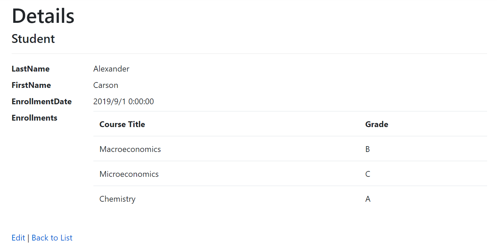

# EF Core 教程
## 2. CRUD操作
### 读取(READ)操作 ###
- 在ContosoUniverisy_1的最后，可以在Pages/Students/Details.cshtml中读取到关于学生的数据:
      
                其中包括学生的姓名与注册日期    
  - 可将原本的OnGetAsync中的读取方法（仅包括id指定）
  ```c#
  Student = await _context.Students.FirstOrDefaultAsync(m => m.ID == id);
  ```
  - 通过Include添加Student-Enrollment-Course的导航逻辑,其中AsNoTracking可以提升性能
  ```c#
  Student = await _context.Students
        .Include(s => s.Enrollments)
        .ThenInclude(e => e.Course)
        .AsNoTracking()
        .FirstOrDefaultAsync(m => m.ID == id);
  ```
  - 然后在html文件中更新添加foreach循环显示该学生的全部课程与成绩
  ```html
        <dt class="col-sm-2">
            @Html.DisplayNameFor(model => model.Student.Enrollments)
        </dt>
        <dd class="col-sm-10">
            <table class="table">
                <tr>
                    <th>Course Title</th>
                    <th>Grade</th>
                </tr>
                @foreach (var item in Model.Student.Enrollments)
                {
                    <tr>
                        <td>
                            @Html.DisplayFor(modelItem => item.Course.Title)
                        </td>
                        <td>
                            @Html.DisplayFor(modelItem => item.Grade)
                        </td>
                    </tr>
                }
            </table>
        </dd>
  ```
- 新的学生详情页面如图所示
      
  可用的读取方法:    
  FirstOrDefaultAsync: 获取读取到的第一个或者NULL(未找到任何内容)    
  SingleOrDefaultAsync: 进获取一个找到的内容或返回null(未找到内容)，如果找到多个内容则触发异常
  FindAsync:可以找到一个具有主键的实体但无法调用Include所以一般用FirstOrDefaultAsync
  
### 创建(CREATE)操作 ###
