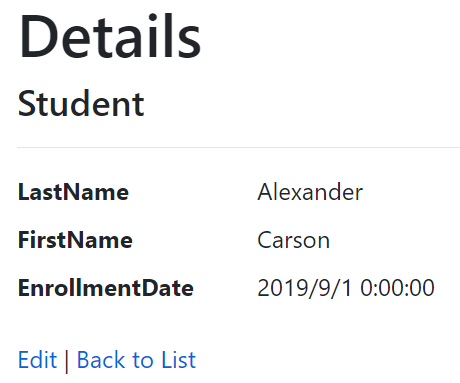
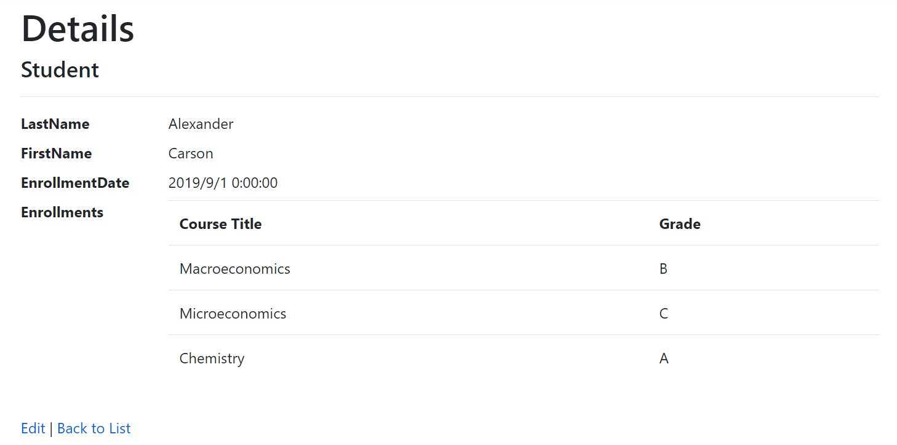

# EF Core 教程
## 2. CRUD操作
### 读取(READ)操作 ###
- 在ContosoUniverisy_1的最后，可以在Pages/Students/Details.cshtml中读取到关于学生的数据:
      
                其中包括学生的姓名与注册日期    
  - 可将原本的OnGetAsync中的读取方法（仅包括id指定）
  ```c#
  Student = await _context.Students.FirstOrDefaultAsync(m => m.ID == id);
  ```
  - 通过Include添加Student-Enrollment-Course的导航逻辑,其中AsNoTracking可以提升性能
  ```c#
  Student = await _context.Students
        .Include(s => s.Enrollments)
        .ThenInclude(e => e.Course)
        .AsNoTracking()
        .FirstOrDefaultAsync(m => m.ID == id);
  ```
  - 然后在html文件中更新添加foreach循环显示该学生的全部课程与成绩
  ```html
        <dt class="col-sm-2">
            @Html.DisplayNameFor(model => model.Student.Enrollments)
        </dt>
        <dd class="col-sm-10">
            <table class="table">
                <tr>
                    <th>Course Title</th>
                    <th>Grade</th>
                </tr>
                @foreach (var item in Model.Student.Enrollments)
                {
                    <tr>
                        <td>
                            @Html.DisplayFor(modelItem => item.Course.Title)
                        </td>
                        <td>
                            @Html.DisplayFor(modelItem => item.Grade)
                        </td>
                    </tr>
                }
            </table>
        </dd>
  ```
- 新的学生详情页面如图所示
      
  可用的读取方法:    
  FirstOrDefaultAsync: 获取读取到的第一个或者NULL(未找到任何内容)    
  SingleOrDefaultAsync: 进获取一个找到的内容或返回null(未找到内容)，如果找到多个内容则触发异常
  FindAsync:可以找到一个具有主键的实体但无法调用Include所以一般用FirstOrDefaultAsync
  
### 创建(CREATE)操作 ###
- 自动生成的代码中在创建操作中有漏洞，其中的OnPostAsync()函数(代码如下)可通过一些HTTP抓包工具给网页中不存在的私有项强行赋值
```c#
public async Task<IActionResult> OnPostAsync()
    {
        if (!ModelState.IsValid)
        {
            return Page();
        }
        // 此处直接添加整个Student，会导致非学生基本信息会被添加
        _context.Students.Add(Student);
        await _context.SaveChangesAsync();

        return RedirectToPage("./Index");
    }
```
- 方法1：使用TryUpdateModelAsync，对其中赋值逻辑做出一些更改，改为如下函数:
```c#
public async Task<IActionResult> OnPostAsync()
    {
        var emptyStudent = new Student();
        // 仅赋值姓名日期等注册时候要填的信息，避免额外信息注入
        //  (s => s.FirstMidName, s => s.LastName, s => s.EnrollmentDate)
        if (await TryUpdateModelAsync<Student>(
            emptyStudent,
            "student",   // Prefix for form value.
            s => s.FirstName, s => s.LastName, s => s.EnrollmentDate))
        {
            _context.Students.Add(emptyStudent);
            await _context.SaveChangesAsync();
            return RedirectToPage("./Index");
        }

        return Page();
    }
```
- 方法2：增加一个视图模型(StudentVM)，专门为这个界面创建一个数据模型，此模型仅包含UI页面所需属性：
```c#
public class StudentVM
{
    public int ID { get; set; }
    public string LastName { get; set; }
    public string FirstName { get; set; }
    public DateTime EnrollmentDate { get; set; }
}
```
- 然后变更一下前端的代码,将原来的Student改为StudentVM：    
```html
@page
@model CreateVMModel

@{
    ViewData["Title"] = "Create";
}

<h1>Create</h1>

<h4>Student</h4>
<hr />
<div class="row">
    <div class="col-md-4">
        <form method="post">
            <div asp-validation-summary="ModelOnly" class="text-danger"></div>
            <div class="form-group">
                <label asp-for="StudentVM.LastName" class="control-label"></label>
                <input asp-for="StudentVM.LastName" class="form-control" />
                <span asp-validation-for="StudentVM.LastName" class="text-danger"></span>
            </div>
            <div class="form-group">
                <label asp-for="StudentVM.FirstName" class="control-label"></label>
                <input asp-for="StudentVM.FirstName" class="form-control" />
                <span asp-validation-for="StudentVM.FirstName" class="text-danger"></span>
            </div>
            <div class="form-group">
                <label asp-for="StudentVM.EnrollmentDate" class="control-label"></label>
                <input asp-for="StudentVM.EnrollmentDate" class="form-control" />
                <span asp-validation-for="StudentVM.EnrollmentDate" class="text-danger"></span>
            </div>
            <div class="form-group">
                <input type="submit" value="Create" class="btn btn-primary" />
            </div>
        </form>
    </div>
</div>

<div>
    <a asp-page="Index">Back to List</a>
</div>

@section Scripts {
    @{await Html.RenderPartialAsync("_ValidationScriptsPartial");}
}
```
- 然后变更一下最初的赋值函数为：
```c#
public async Task<IActionResult> OnPostAsync()
    {
        if (!ModelState.IsValid)
        {
            return Page();
        }
        // 此处用StudentVM赋值给Student类避免了多余数据的添加
        var entry = _context.Add(new Student());
        entry.CurrentValues.SetValues(StudentVM);
        await _context.SaveChangesAsync();

        return RedirectToPage("./Index");
    }
```

### 编辑(UPDATE)操作 ###    
- 在Students/Edit.cshtml.cs中，OnPostAsync方法中的问题与创建界面一样，也可以更改一下以避免过度发布和数据注入，而对于OnGetAsync，我们可以使用FindAsync方法（因为不需要include，效率更高），可将代码更新为如下代码：
```c#
public async Task<IActionResult> OnGetAsync(int? id)
{
    if (id == null)
    {
        return NotFound();
    }

    Student = await _context.Students.FindAsync(id);

    if (Student == null)
    {
        return NotFound();
    }
    return Page();
}

public async Task<IActionResult> OnPostAsync(int id)
{
    var studentToUpdate = await _context.Students.FindAsync(id);

    if (studentToUpdate == null)
    {
        return NotFound();
    }

    if (await TryUpdateModelAsync<Student>(
        studentToUpdate,
        "student",
        s => s.FirstMidName, s => s.LastName, s => s.EnrollmentDate))
    {
        await _context.SaveChangesAsync();
        return RedirectToPage("./Index");
    }

    return Page();
}
```
### 删除(DELETE)操作 ###
-  更新Pages/Students/Delete.cshtml.cs中代码，以添加日志与网页报错功能 ：
```c#
using ContosoUniversity.Models;
using Microsoft.AspNetCore.Mvc;
using Microsoft.AspNetCore.Mvc.RazorPages;
using Microsoft.EntityFrameworkCore;
using Microsoft.Extensions.Logging;
using System;
using System.Threading.Tasks;

namespace ContosoUniversity.Pages.Students
{
    public class DeleteModel : PageModel
    {
        private readonly ContosoUniversity.SchoolContext _context;
        private readonly ILogger<DeleteModel> _logger;
        // 创建日志
        public DeleteModel(ContosoUniversity.SchoolContext context,
                           ILogger<DeleteModel> logger)
        {
            _context = context;
            _logger = logger;
        }

        [BindProperty]
        public Student Student { get; set; }
        public string ErrorMessage { get; set; }

        public async Task<IActionResult> OnGetAsync(int? id, bool? saveChangesError = false)
        {
            if (id == null)
            {
                return NotFound();
            }

            Student = await _context.Students
                .AsNoTracking()
                .FirstOrDefaultAsync(m => m.ID == id);

            if (Student == null)
            {
                return NotFound();
            }

            if (saveChangesError.GetValueOrDefault())
            {
                ErrorMessage = String.Format("Delete {ID} failed. Try again", id);
            }

            return Page();
        }

        public async Task<IActionResult> OnPostAsync(int? id)
        {
            if (id == null)
            {
                return NotFound();
            }

            var student = await _context.Students.FindAsync(id);

            if (student == null)
            {
                return NotFound();
            }

            try
            {
                _context.Students.Remove(student);
                await _context.SaveChangesAsync();
                return RedirectToPage("./Index");
            }
            catch (DbUpdateException ex)
            {
                // 捕获报错
                _logger.LogError(ex, ErrorMessage);

                return RedirectToAction("./Delete",
                                     new { id, saveChangesError = true });
            }
        }
    }
}
```
- 然后再HTML文件中添加错误信息映射:
```html
<p class="text-danger">@Model.ErrorMessage</p>
```

运行即可使用更安全的CRUD功能