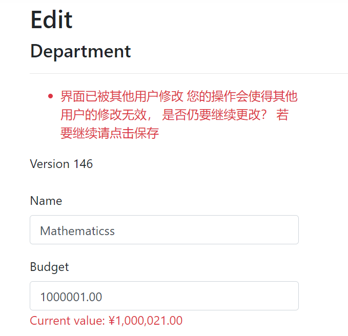

# EF Core 教程
## 6.并发与冲突处理
- 在应用中，可能会出现并发状况，需要考虑并发冲突的处理。
    - 其中，EntityFramework Core 不提供对悲观并发的内置支持。
    - 对于在官方教程中，使用了存储优先的方案，确保用户在未收到警报的时候不会覆盖任何更改。（后修改的用户会报错，并显示当前的状态，允许重新应用更改）
    
- 在之前未做过更改的系上做一些更改以实现冲突处理
  - 增加一个[Timestamp]系数用于识别并发并跟踪，在读取数值的时候获得一个token值，然后在更新的时候校验这个值是否等于原值，若等于则可以更新
  - 使用迁移功能更新数据库
  - 搭建院系基架
  - 增加Utility类(工具类，放在最外层)，声明静态方法来获得token最后几个字符
  - 更新目录类应用Utility中静态方法
  - 更新编辑与删除    
  效果如下：    
    